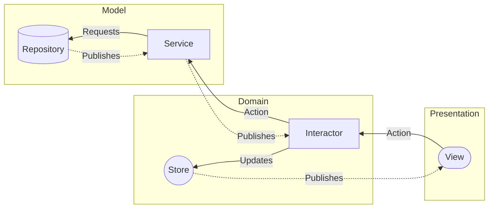

<h1 align="center">
   
  MVS Calories
   
</h1>

<h4 align="center">A pure <a href="https://developer.apple.com/xcode/swiftui/" target="_blank">SwiftUI</a> implementation for building scalable mobile applications.</h4>

  <a href="#key-features">Key Features</a> •
  <a href="#architecture">Architecture</a> •
  <a href="#installation">Installation</a> •
  <a href="#coverage">Coverage</a> •
  <a href="#team">Team</a> •
  <a href="#quicklinks">Quick Links</a>

## Key Features

* Vanilla SwiftUI Implementation:
    * Combine for observer and publisher chains.
    * Combine for network and repository layer.
* Injection - Dependency injection using a SwiftUI `EnvironmentValues` like implementation for native first party support:
    * Allows for ease of mocking and inversion of control within the application.
    * Provides compile time safe registration of dependencies. (If the project builds! All dependencies have been registered correctly.)
    * Dependency provision by abstraction, allowing for dependencies to be injected by their abstract (protocol or superclass) types.
    * Property wrappers for injectables as well as support for injecting observable types similar to SwiftUI's concrete implementation of `@ObservedObject`
* Theming: [REDACTED] (To be added back in future)
    * Theme injection through view heirarchy to provide developers with the necessary values and styles for use in their SwiftUI views.
    * No need for hard coding any values, the following are supported by the Combustion design system:
        * Colors
        * Spacing (Internal)
        * Spacing (Margins/External)
        * Motion (Animations and delays)
        * Shapes (Defenitions for backgrounds and materials)
    * Automatic switching of dark and light mode with support for user customization.
* ELMs (MVU/Stores/State/Unidirectional data flow) inspired architecture with clean separation of concerns:
    * Decoupled **presentation**, **business logic** and **data access** layers.
    * Provides `functional immutibility` of values and state for high cohesion and state safety.
    * State updates automatically cause view recomposition of relevant consumers through the `@Published` and `@InjectObservable` wrappers.
        * Views are functions of state within the application, leading to highly performant and predictable UI.
    * Side-effects are controlled and isolated to interactors/interactions.
        * `Side-effects` only produce updates to state publishers and do not mutate data, instead publsish new `Value-Type` states.
    * Build with scalability and testibility in mind for iterating and delivering quickly.
    * Highly testable at both unit and integration level. 
        * Testing using `XCTest + ViewInspector` (Unit testing SwiftUI views) and `XCUITest` [REDACTED] (To be added back in future)
        * Highly modular for testing in isolation
        * First party network mocking through URLProtocol injection and compile time safe mocked responses. [REDACTED] (To be added back in future)

## Architecture

*(If you only see markdown, you may requires the MermaidJS browser plugin)*

